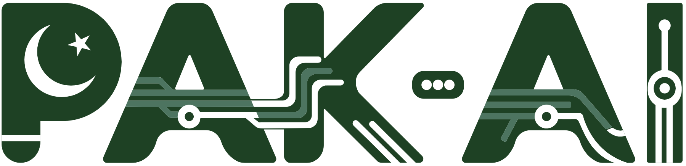

<!-- ============================= HERO ============================= -->
<div align="center">



<br><br>


<p><b>Founder &amp; CEO — PAK-AI</b> &nbsp;|&nbsp; Senior AI/ML Engineer &nbsp;|&nbsp; 6+ Years</p>

<p><i>I turn hard problems into intelligent systems that actually ship — and I built a company to do it at scale.</i></p>

[](https://pak-ai-web.vercel.app)
[](https://www.linkedin.com/in/ali-nawaz-khattak/)
[](mailto:nawazktk99@gmail.com)

<br>


</div>

---

## 👋 Who I Am

I'm a technical founder who sits where **research, production engineering, and business** meet. Most AI work dies as a demo — mine doesn't. Over 6+ years I've shipped computer-vision, LLM, and enterprise-AI systems into real environments, backed by peer-reviewed research and an obsession with things that work *after* the pitch.

In **2024 I founded [PAK-AI](https://pak-ai-web.vercel.app)** — an applied-AI company proving that world-class intelligent systems can be built *from Pakistan, for the world.*

> **My promise:** research-grade thinking, engineered like production software, owned from first workshop to long-term support.

---

## 🏢 PAK-AI — Applied AI, Delivered End-to-End

**PAK-AI** turns business problems into production-grade AI. We don't hand off notebooks — we own the full lifecycle: **research → build → deploy → QA → support.**

### What We Deliver

| Capability | What it means for you |
|---|---|
| 🤖 **Agentic AI & RAG** | Assistants and autonomous agents grounded in *your* data |
| 👁️ **Computer Vision** | Detection, tracking & action recognition for safety and compliance |
| ⚙️ **ML & MLOps** | Custom models with reliable training, deployment & monitoring |
| ☁️ **ERP & Cloud** | Workflow automation and enterprise systems on AWS / Azure |
| 🏥 **Medical Imaging** | Diagnostic-assist, segmentation & classification for healthcare |
| 🧠 **NLP & LLMs** | Document intelligence, extraction & language understanding |
| 📊 **Predictive Analytics** | Forecasting and decision support from operational data |

### How We Engage

```
1 · DISCOVER    Scope the problem, define ROI and success metrics
2 · PROTOTYPE   Validate value fast with a working proof-of-concept
3 · BUILD       Production system — APIs, testing, monitoring, docs
4 · SHIP        Deploy, QA, and support the system long-term
```

<div align="center">

[](https://pak-ai-web.vercel.app)

</div>

---

## 🗂️ Selected Work

**🏛️ FIA Smart ACR/PER Management System**
Replaced a manual, paper-based government appraisal process with a secure, auditable digital platform — automating ACR/PER records, review workflows, and reporting.
`FastAPI` · `PostgreSQL` · `Workflow Automation` · `Enterprise ERP`

**🤖 Agentic AI & RAG Platform**
Production RAG pipelines and autonomous agents for document intelligence and enterprise knowledge assistants.
`LangChain` · `LangGraph` · `OpenAI / Azure OpenAI` · `FastAPI`

**👁️ Real-Time Computer Vision Suite**
Detection, tracking, and action-recognition for safety, compliance, and industrial monitoring — optimized for the edge.
`YOLOv11` · `SAM2` · `ST-GCN` · `PyTorch`

**🏥 Medical Imaging & Diagnostics AI**
Computer-aided diagnosis pipelines — segmentation, classification, and diagnosis-assist for clinical imaging.
`TensorFlow` · `PyTorch` · `MONAI`

---

## ⚡ How I Work

- **Production over demos** — if it can't run reliably in the real world, it isn't done.
- **Own the whole lifecycle** — from problem framing to deployment and maintenance.
- **Research-grade, business-driven** — rigor where it counts, pragmatism everywhere else.
- **Built in Pakistan, delivered globally** — proving local talent competes at the top.

---

## 🛠️ Technical Expertise

**AI / ML** — `Python` · `PyTorch` · `TensorFlow` · `scikit-learn` · `OpenCV` · `YOLO` · `ONNX`

**LLMs & GenAI** — `OpenAI` · `Azure OpenAI` · `LangChain` · `LangGraph` · `Hugging Face` · `RAG` · `LlamaIndex`

**Backend & Deployment** — `FastAPI` · `Flask` · `Django` · `Docker` · `Kubernetes` · `AWS` · `Azure`

**Data** — `PostgreSQL` · `MongoDB` · `MySQL` · `Redis` · `Elasticsearch`

---

## 🎓 Background & Credentials

- **Founder & CEO, PAK-AI** — applied-AI company, end-to-end delivery (Est. 2024)
- **6+ years** shipping AI/ML systems in industry
- **MS, Software Engineering** — UET Taxila
- **4+ peer-reviewed publications** — IEEE & international journals
- **Prime Minister Laptop Award** — Top 10 in Software Engineering

---

<div align="center">


</div>

---

<!-- ============================= CTA ============================= -->
<div align="center">

## Let's build something intelligent together.

PAK-AI partners with startups, enterprises, and government teams to ship AI that works in production.
If you have a problem worth solving, I'd like to hear about it.

[](mailto:nawazktk99@gmail.com)
[](https://pak-ai-web.vercel.app)

<br>


</div>
