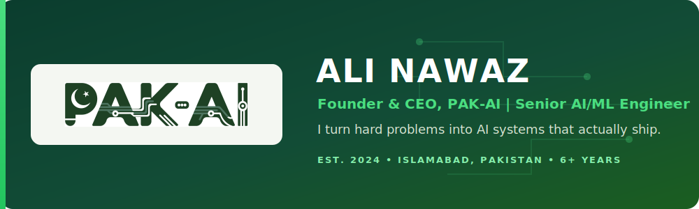

<!-- ============================= HERO ============================= -->
<div align="center">



<br><br>

<a href="https://git.io/typing-svg"></a>

<p><b>Founder &amp; CEO, PAK-AI</b> &nbsp;|&nbsp; Senior AI/ML Engineer &nbsp;|&nbsp; 6+ Years</p>

<p><i>I turn hard problems into AI systems that actually ship, and I built a company to do it at scale.</i></p>

[](https://github.com/aliktk)
[](https://github.com/aliktk?tab=followers)

[](https://pak-ai-web.vercel.app)
[](https://www.linkedin.com/in/ali-nawaz-khattak/)
[](mailto:nawazktk99@gmail.com)

</div>


<!-- ============================= ABOUT ME ============================= -->
<table>
<tr>
<td width="58%" valign="top">

### 👨‍💻 A Bit About Me

```python
ali = {
    "role": "AI/ML Engineer + Founder",
    "base": "Islamabad, Pakistan 🇵🇰",
    "experience": "6+ years",
    "focus": ["Computer Vision", "NLP", "GenAI", "Agentic AI"],
    "currently": "Building PAK-AI",
    "believes_in": "Shipping research, not just demos",
}
```

I'm a technical founder who works across research, engineering, and business. A lot of AI never makes it past the demo stage. Mine does. For the past six years I've built computer vision, LLM, and enterprise AI systems that run in real production, and I back that work with published research.

</td>
<td width="42%" valign="top">

<br>


</td>
</tr>
</table>

### 🔭 What I'm Working On

```yaml
🚀 PAK-AI:          "Growing my applied AI company"
🤖 Agentic_AI:      "RAG pipelines and autonomous agents"
👁️ Computer_Vision: "YOLO, SAM2, real-time detection"
🧠 LLMs:            "Document intelligence and assistants"
🏥 Medical_AI:      "Imaging and diagnosis support systems"
```


<!-- ============================= PAK-AI ============================= -->
## 🏢 PAK-AI: Applied AI, Built to Last

PAK-AI builds AI systems that solve real business problems. We don't hand over a notebook and walk away. We stay with a project through every stage: research, building, deployment, testing, and support.

### What We Deliver

| Capability | What it means for you |
|---|---|
| 🤖 **Agentic AI & RAG** | Assistants and autonomous agents grounded in your own data |
| 👁️ **Computer Vision** | Detection, tracking, and action recognition for safety and compliance |
| ⚙️ **ML & MLOps** | Custom models with reliable training, deployment, and monitoring |
| ☁️ **ERP & Cloud** | Workflow automation and enterprise systems on AWS or Azure |
| 🏥 **Medical Imaging** | Diagnostic support, segmentation, and classification for healthcare |
| 🧠 **NLP & LLMs** | Document intelligence, extraction, and language understanding |
| 📊 **Predictive Analytics** | Forecasting and decision support from your operational data |

### How We Work With You

```
1 · DISCOVER    Scope the problem, agree on ROI and success metrics
2 · PROTOTYPE   Prove the value fast with a working proof of concept
3 · BUILD       Ship a production system: APIs, testing, monitoring, docs
4 · SUPPORT     Deploy, run QA, and maintain the system over time
```

<div align="center">

[](https://pak-ai-web.vercel.app)

</div>


<!-- ============================= SELECTED WORK ============================= -->
## 🗂️ Selected Work

<div align="center">

<table>
<tr>
<td width="50%" align="center" valign="top">
  <a href="https://github.com/aliktk/smart-acr">
    
  </a>
  <p><sub>🏛️ Secure on-prem platform digitizing FIA ACR/PER workflows: role based access, countersigning, reporting, and dossier archiving.</sub></p>
</td>
<td width="50%" align="center" valign="top">
  <a href="https://github.com/aliktk/pak-ai">
    
  </a>
  <p><sub>🚀 The PAK-AI web platform: portfolio, case studies, service showcases, and lead capture for the company.</sub></p>
</td>
</tr>
<tr>
<td width="50%" align="center" valign="top">
  <a href="https://github.com/aliktk/media-spy">
    
  </a>
  <p><sub>📡 Multi-tenant, AI-native media intelligence and OSINT platform across broadcast, social, print, and web.</sub></p>
</td>
<td width="50%" align="center" valign="top">
  <a href="https://github.com/aliktk/MCQ-Generator">
    
  </a>
  <p><sub>🧠 LangChain and OpenAI app that generates custom MCQs from PDF or text, with difficulty and subject controls.</sub></p>
</td>
</tr>
<tr>
<td width="50%" align="center" valign="top">
  <a href="https://github.com/aliktk/object_detection_yolov8">
    
  </a>
  <p><sub>👁️ Full YOLOv8 workflow: training, exporting, optimizing, and deploying models for object detection.</sub></p>
</td>
<td width="50%" align="center" valign="top">
  <a href="https://github.com/aliktk/stt-endpoint">
    
  </a>
  <p><sub>🎙️ Plug-and-play speech-to-text pipeline: API-first with a local faster-whisper fallback, FastAPI and Streamlit.</sub></p>
</td>
</tr>
</table>

<sub>🔬 Research work also spans medical imaging: eye disease, myopia progression, and bone scintigraphy classification.</sub>

[](https://github.com/aliktk?tab=repositories)

</div>


<!-- ============================= TECH STACK ============================= -->
## 🛠️ Tech Stack

<div align="center">

### 🤖 AI & Machine Learning


### 🧠 LLMs & GenAI


### ⚙️ Backend, Cloud & Data


</div>


<!-- ============================= GITHUB STATS ============================= -->
<h2 align="center">📊 My GitHub Stats & Activity</h2>

<div align="center">


<br><br>


<br><br>


</div>

<h2 align="center">🏆 Highlights</h2>

<div align="center">


</div>

<h2 align="center">🐍 Contribution Snake</h2>

<div align="center">

<picture>
  <source media="(prefers-color-scheme: dark)" srcset="https://raw.githubusercontent.com/Aliktk/Aliktk/output/github-contribution-grid-snake-dark.svg" />
  <source media="(prefers-color-scheme: light)" srcset="https://raw.githubusercontent.com/Aliktk/Aliktk/output/github-contribution-grid-snake.svg" />
  
</picture>

</div>

<h2 align="center">⏱️ Weekly Coding Stats</h2>

<div align="center">


</div>

<!--START_SECTION:waka-->
<!--END_SECTION:waka-->

<sub>⏳ WakaTime breakdown updates daily once the API key secret is set (see repo Actions).</sub>


<!-- ============================= CREDENTIALS ============================= -->
## 🎓 Background & Credentials

- **Founder & CEO, PAK-AI**, an applied AI company covering the full delivery cycle (est. 2024)
- **6+ years** shipping AI and ML systems in industry
- **MS, Software Engineering**, UET Taxila
- **4+ peer reviewed publications** in IEEE and international journals
- **Prime Minister Laptop Award**, ranked top 10 in Software Engineering

<!-- ============================= CONNECT ============================= -->
<h2 align="center">🤝 Connect With Me</h2>

<div align="center">

[](https://www.linkedin.com/in/ali-nawaz-khattak/)
[](https://twitter.com/engr_ali_nawaz/)
[](https://medium.com/@nawazktk99)
[](https://www.youtube.com/channel/UCXU3qvcf33IzYHHHpJKrLvw)
[](https://www.kaggle.com/alinawazktk)
[](mailto:nawazktk99@gmail.com)

</div>


<!-- ============================= CTA ============================= -->
<div align="center">

## Let's build something intelligent together.

PAK-AI works with startups, enterprises, and government teams to ship AI that holds up in production. If you have a problem worth solving, I'd like to hear about it.

[](mailto:nawazktk99@gmail.com)
[](https://pak-ai-web.vercel.app)

<br>


<br><br>


</div>
